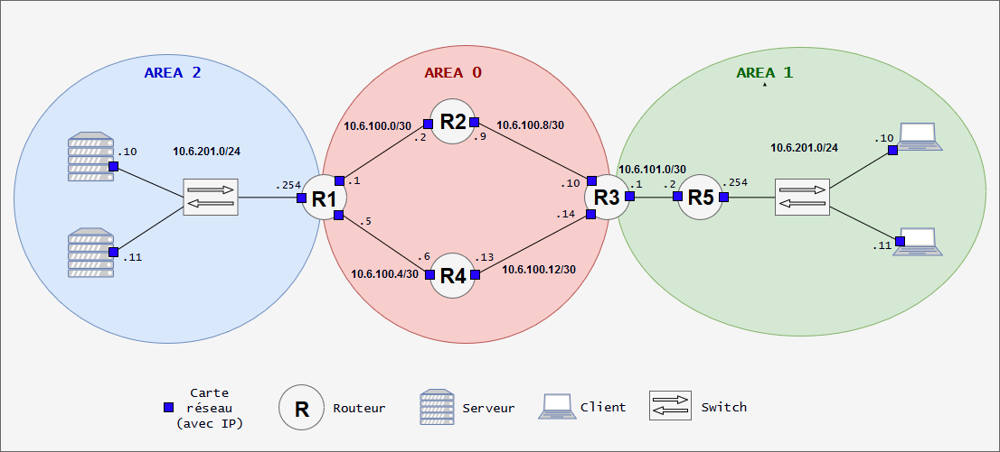

# B1 Réseau 2018 - TP6

[Ici](https://github.com/It4lik/B1-Reseau-2018/tree/master/tp/6) l'énoncé du TP 6..

# Sommaire

* [Matériels utilisés](#matériels-utilisés)
* [Présentation du lab](#présentation-du-lab)
    * [Aires OSPF](#aires-ospf)
    * [Réseaux IP et aires OSPF](#réseaux-ip-et-aires-ospf)
    * [Adressage IP de chacune des machines](#adressage-ip-de-chacune-des-machines)
        * [Définir une IP statique des routeurs](#définir-une-ip-statique-des-routeurs)
        * [Définir l'hostname des routeurs](#définir-l'hostname-des-routeurs)
        * [Configuration de OSPF](#configuration-de-ospf)
* [NAT : accès internet](#nat-:-accès-internet)
    * [Configuration du NAT](#configuration-du-nat)
* [Un service d'infra](#un-service-d'infra)

# Matériels utilisés

* Logiciel utilisés:
    * Virtualbox
    * GNS3

* les machines virtuelles Linux :
    * CentOS 7

* les routeurs:
    * Cisco 3640

* les switches :
    * Ethernet Switch dans GNS3

# Présentation du lab

Petit schema récapitulatif :

<p align="center">
  
</p>

(Oui j'ai piqué la photo :P )

## Aires OSPF

Dans se TP je decouvre **OSPF**.

Ou je met 3 *area* en place.

Nous allons nous servir des aires OSPF pour distinguer :

* Une aire "backbone" *(l'aire principale)*
    
        AREA 0
    
    * toutes les autres y sont connectées
        donc tout trafic qui change d'aire passe forcément par celle-ci

    * le **WAN** (~= internet) est souvent accessible depuis l'aire "backbone"

* Une aire pour les clients
    
        AREA 1
    
    * X clients seront ajoutés (Quelque chose comme 2/3 clients)

    * leur adressage IP et leur table de routage seront gérées automatiquement

    * Un serveur DHCP 

* Une aire pour les services d'infrastructures

        AREA 2

    * Un serveur web ou un netcat simple, pour simuler un service un service disponible

## Réseaux IP et aires OSPF

Dans chacune des aires OSPF se trouveront des réseaux IP.

Réseaux | `area 0` | `area 1` | `area 2` | Infos
--- | --- | --- | --- | ---
`10.6.100.0/30` | X | - | - | Liaison entre `r1` et `r2`
`10.6.100.4/30` | X | - | - | Liaison entre `r1` et `r4`
`10.6.100.8/30` | X | - | - | Liaison entre `r2` et `r3` 
`10.6.100.12/30` | X | - | - | Liaison entre `r3` et `r4`
`10.6.101.0/30` | - | X | - | Liaison entre `r3` et `r5`
`10.6.201.0/24` | - | X | - | Réseau des clients
`10.6.202.0/24` | - | - | X | Réseau des serveurs

## Adressage IP de chacune des machines

Machines | `10.6.100.0/30` | `10.6.100.4/30` | `10.6.100.8/30` | `10.6.100.12/30` | `10.6.101.0/30` | `10.6.201.0/24` | `10.6.202.0/24`
--- | --- | --- | --- | --- | --- | --- | --- 
`r1.tp6.b1` | `10.6.100.1` | `10.6.100.5` | - | - | - | - | `10.6.202.254`
`r2.tp6.b1` | `10.6.100.2` | - |  `10.6.100.9` | - | - | - | -
`r3.tp6.b1` | - | - | `10.6.100.10` | `10.6.100.14` | `10.6.101.1` | - | -
`r4.tp6.b1` | - |  `10.6.100.6` | - | `10.6.100.13` | - | - | -
`r5.tp6.b1` | - | - | - | - |  `10.6.101.2` |  `10.6.201.254` | -
`client1.tp6.b1` | - | - | - | - | - |  `10.6.201.10` | -
`client2.tp6.b1` | - | - | - | - | - |  `10.6.201.11` | -
`server1.tp6.b1` | - | - | - | - | - | - | `10.6.202.10`

### Définir une IP statique des routeurs

**Passer en mode configuration d'interface**

        conf t
        (config)# interface ethernet <NUMERO>

**Définir une IP**

        (config-if)# ip address <IP> <MASK>

*Exemple :*

        (config-if)# ip address 10.6.100.1 255.255.255.252

**Dire a l'interface de ne jamais s'éteindre**

        (config-if)# no shut

**Sauvegarder**

        (config-if)# exit
        (config)# exit
        write

Faire ceci sur tous les *Routeur* :D

### Définir l'hostname des routeurs

**Passer en mode configuration d'interface**

        conf t
        (config)# interface ethernet <NUMERO>

**Choisir un hostname**

        (config)# hostname [Inserer un hostname]

Les VMs client et serveur ping leurs routeur !
ET les routeur se ping entre eux !

### Configuration de OSPF

**Passer en mode configuration**

        # conf t

**Activer OSPF**

        (config)# router ospf 1

le 1 correspond à l'ID de ce processus OSPF

**Définir un router-id**

        (config-router)# router-id 1.1.1.1

*router-id 1.1.1.1 pour le router1 pour le router2 2.2.2.2.. pour le router3 3.3.3.3.. Etc jusqu'au router5.*

**Partager une ou plusieurs routes**

        (config-router)# network 10.6.100.0 0.0.0.3 area 0

Pour confirmer la fonctionnement du bon réglages de tooouuuuuus les routers..

```
    r1.tp6#ping 10.6.101.1

    Type escape sequence to abort.
    Sending 5, 100-byte ICMP Echos to 10.6.101.1, timeout is 2 seconds:
    !!!!!
    Success rate is 100 percent (5/5), round-trip min/avg/max = 40/44/48 ms
```

# NAT : accès internet

* GOGO GADGETO rajouter un cloud dans **GNS3**
* Ajouter une liaison entre **R4** et le **cloud**
* Configurer la nouvel interface d'R4 (du fais de la nouvel liaison de R4)


```
    r4.tp6.b1# conf t
    r4.tp6.b1(config)# interface fastEthernet 0/0
    r4.tp6.b1(config-if)# ip address dhcp
    r4.tp6.b1(config-if)# no shut
```

J'ai fais toute la config pour que mon ping vers google passe mais pas OK..
J'ai commencé à avoir peur car j'avais tout de bon !!!!!

Puis je vois :

        à YNOV, on peut pas ping vers l'extérieur

OUF !!!!! :)

Pour bien s'assurer que j'ai reussi à me CO au **NAT**:

**Mode configuration**

```
    r4.tp6.b1# conf t
```
**Activation du lookup DNS**
```
    r4.tp6.b1(config)# ip domain-lookup
```

**Configuration du serveur DNS (celui de google)**

        r4.tp6.b1(config)# ip name-server 8.8.8.8

**Requête web vers un site full HTTP, avec résolution de nom**

        r4.tp6.b1(config)# exit
        r4.tp6.b1# telnet trip-hop.net 80
        GET /

Tous ça pour recuperer :

```
    HTTP/1.1 400 Bad Request
    Date: Tue, 05 Mar 2019 14:30:56 GMT
    Cache-Control: no-cache
    Content-Type: text/html
    X-Cache: MISS from PF1-BOR1FR
    X-Cache-Lookup: MISS from PF1-BOR1FR:3128
    Connection: close

    <html><body><h1>400 Bad request</h1>
                                        Your browser sent an invalid request.
                                                                            </body></html>

    [Connection to trip-hop.net closed by foreign host]
```

**BREF ! Je suis OK !!!**

## Configuration du NAT

Pour "configurer le NAT" GOGO :
```
    r4.tp6.b1# conf t
    r4.tp6.b1(config)# interface fastEthernet 0/0
    r4.tp6.b1(config-if)# ip nat outside
    r4.tp6.b1(config-if)# exit

    r4.tp6.b1(config)# interface fastEthernet 1/0
    r4.tp6.b1(config-if)# ip nat inside
    r4.tp6.b1(config-if)# exit

    r4.tp6.b1(config)# interface fastEthernet 2/0
    r4.tp6.b1(config-if)# ip nat inside
    r4.tp6.b1(config-if)# exit
```

**Ensuite :**
```
    r4.tp6.b1# conf t
    r4.tp6.b1(config)# ip nat inside source list 1 interface fastEthernet 0/0 overload
    r4.tp6.b1(config)# access-list 1 permit any
```

**Partager la route par défaut à tout le monde**
```
    r4.tp6.b1# conf t
    r4.tp6.b1(config)# router ospf 1
    r4.tp6.b1(config-router)# default-information originate
```

Test des ping vers `google.com` **OK !!**

# Un service d'infra

On va mettre en place un simple serveur web avec une page d'accueil.

Sur la machine `server1.tp6.b1` :

**S'assurer que le firewall est démarré**

        sudo systemctl status firewalld
        sudo systemctl start firewalld

**Ajouter une règle pour le trafic web**

        sudo firewall-cmd --add-port=80/tcp --permanent
        sudo firewall-cmd --reload

**Installation du serveur web**

        sudo yum install -y epel-release
        sudo yum install -y nginx

**Lancement du serveur web**

        sudo systemctl start nginx

**Je vais personnaliser une super page d'accueil !**

        sudo nano /usr/share/nginx/html/index.html

**S'assurer que le serveur fonctionne et répond**

        curl localhost

Il m'a fallut ajouter un DNS aux VMs !
Pour cela:

        vi /etc/resolv.conf 
    ==> nameserver 8.8.8.8

Gogo `curl 10.6.202.10`
**OK !**